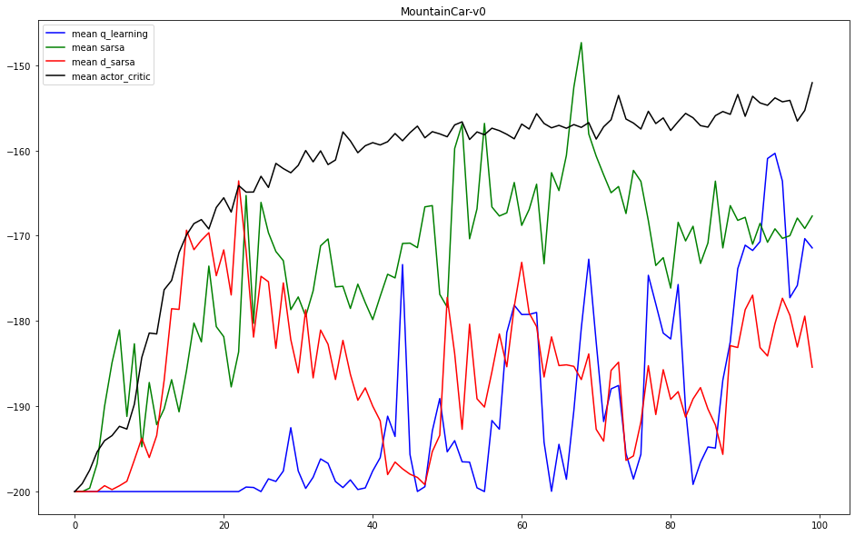
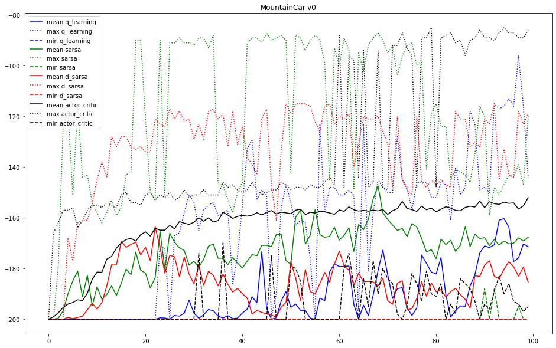
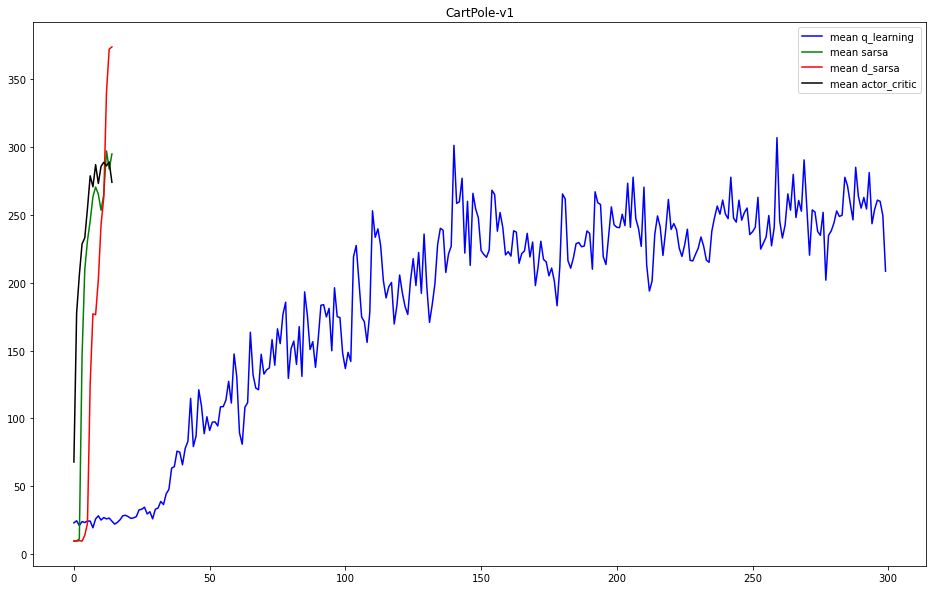
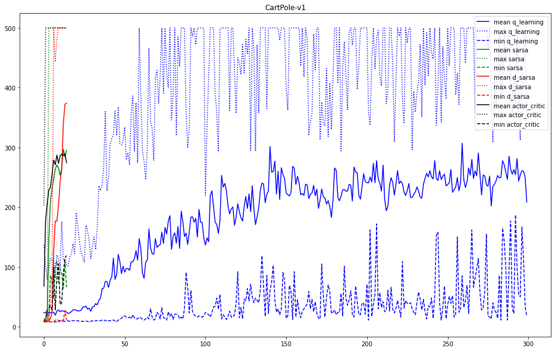

# Classic Control

The plots below show the results of solving each environment with available algorithms:

The lines illustrate the average, minimum and maximum reward of every 100 episodes.

## MountainCar-v0

 
 

## CartPole-v1

 
 

`sarsa`, `d_sarsa` and `actor_critic` were only trained for 1500 episodes, but `q_learning` was trained for 30000 episodes.
